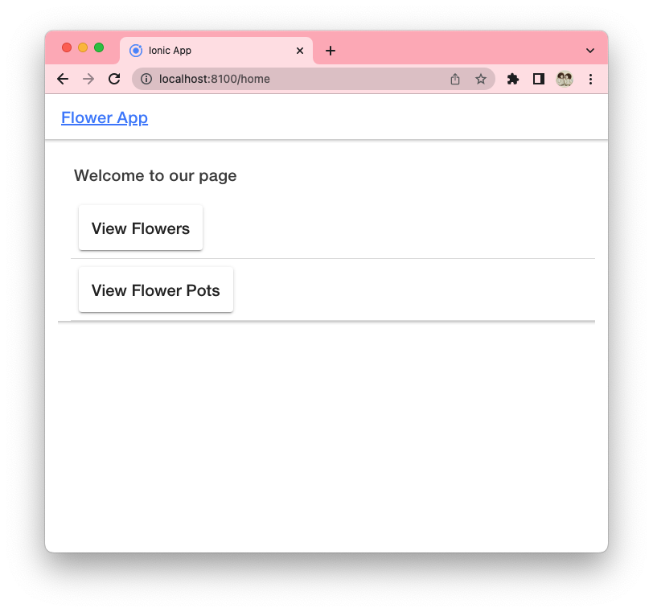

# SignIn App

An Ionic App in React

## Features

- Login screen
- Registration screen
- Flowers pages behind login
- Flower pots pages behind login
- Connecting Ionic app to Firebase authentication
- Using React framework

## Documentation

[Firebase Documentation](https://firebase.google.com/docs/auth/web/password-auth?authuser=0#create_a_password-based_account)

[React Documentation](https://react.dev/)

## Screenshots

## License

[MIT](https://choosealicense.com/licenses/mit/)
